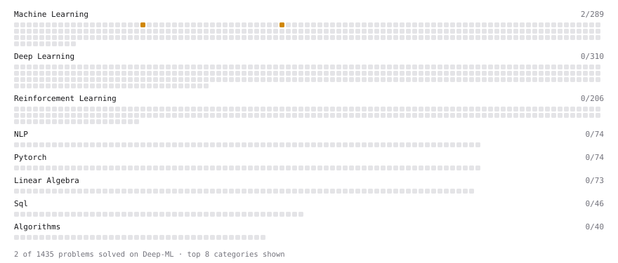

# Deep-ML

My machine learning practice from [Deep-ML](https://www.deep-ml.com). Every solution here was written by hand.

**5** solved · 1 problems · 0 labs · 4 math

[**Browse the interactive portfolio**](https://Mitfort.github.io/deep-ml/) to replay this filling in over time.

## Problems

| | Difficulty | Solved | |
| --- | --- | --- | --- |
| [Implement Lasso Regression using ISTA](https://www.deep-ml.com/problems/50) | medium | 2026-09-22 | [solution](problems/0050-implement-lasso-regression-using-ista) |

## Math

| | Difficulty | Solved | |
| --- | --- | --- | --- |
| [Model Selection: CV, AIC, and BIC](https://www.deep-ml.com/math-problems/43) | easy | 2026-09-22 | [solution](math/0043-model-selection-cv-aic-and-bic) |
| [Bias–Variance Decomposition](https://www.deep-ml.com/math-problems/39) | medium | 2026-09-22 | [solution](math/0039-bias-variance-decomposition) |
| [Covariance and Correlation](https://www.deep-ml.com/math-problems/17) | medium | 2026-09-22 | [solution](math/0017-covariance-and-correlation) |
| [Information Theory: Entropy](https://www.deep-ml.com/math-problems/24) | medium | 2026-09-22 | [solution](math/0024-information-theory-entropy) |

---

_This file is regenerated by Deep-ML on every push._
