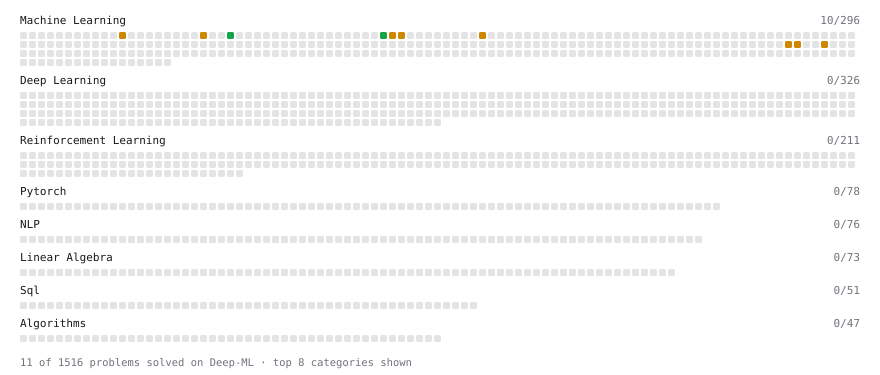

# Deep-ML

My machine learning practice from [Deep-ML](https://www.deep-ml.com). Every solution here was written by hand.

**13** solved · 9 problems · 0 labs · 4 math

[**Browse the interactive portfolio**](https://Mitfort.github.io/deep-ml/) to replay this filling in over time.

## Problems

| | Difficulty | Solved | |
| --- | --- | --- | --- |
| [Implement Early Stopping Based on Validation Loss](https://www.deep-ml.com/problems/135) | easy | 2026-10-01 | [solution](problems/0135-implement-early-stopping-based-on-validation-loss) |
| [Implement Gini Impurity Calculation for a Set of Classes](https://www.deep-ml.com/problems/64) | easy | 2026-10-01 | [solution](problems/0064-implement-gini-impurity-calculation-for-a-set-of-classes) |
| [Implement Weight Decay as L2 Regularization](https://www.deep-ml.com/problems/198) | easy | 2026-09-23 | [solution](problems/0198-implement-weight-decay-as-l2-regularization) |
| [Bias-Variance Decomposition from Bootstrap](https://www.deep-ml.com/problems/804) | medium | 2026-10-01 | [solution](problems/0804-bias-variance-decomposition-from-bootstrap) |
| [Elastic Net Regression via Gradient Descent](https://www.deep-ml.com/problems/139) | medium | 2026-09-23 | [solution](problems/0139-elastic-net-regression-via-gradient-descent) |
| [Generate Sorted Polynomial Features](https://www.deep-ml.com/problems/32) | medium | 2026-09-25 | [solution](problems/0032-generate-sorted-polynomial-features) |
| [Implement Lasso Regression using ISTA](https://www.deep-ml.com/problems/50) | medium | 2026-09-22 | [solution](problems/0050-implement-lasso-regression-using-ista) |
| [Learning Curve Generator for Bias-Variance Diagnosis](https://www.deep-ml.com/problems/800) | medium | 2026-10-01 | [solution](problems/0800-learning-curve-generator-for-bias-variance-diagnosis) |
| [Polynomial Regression Fit](https://www.deep-ml.com/problems/801) | medium | 2026-09-23 | [solution](problems/0801-polynomial-regression-fit) |

## Math

| | Difficulty | Solved | |
| --- | --- | --- | --- |
| [Model Selection: CV, AIC, and BIC](https://www.deep-ml.com/math-problems/43) | easy | 2026-09-22 | [solution](math/0043-model-selection-cv-aic-and-bic) |
| [Bias–Variance Decomposition](https://www.deep-ml.com/math-problems/39) | medium | 2026-09-22 | [solution](math/0039-bias-variance-decomposition) |
| [Covariance and Correlation](https://www.deep-ml.com/math-problems/17) | medium | 2026-09-22 | [solution](math/0017-covariance-and-correlation) |
| [Information Theory: Entropy](https://www.deep-ml.com/math-problems/24) | medium | 2026-09-22 | [solution](math/0024-information-theory-entropy) |

---

_This file is regenerated by Deep-ML on every push._
